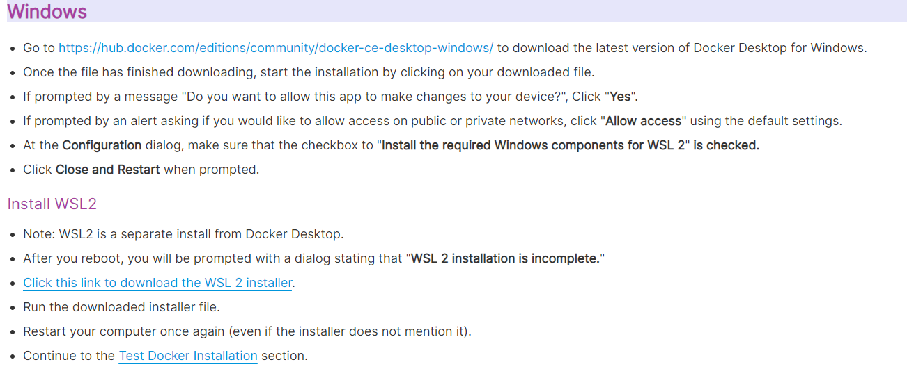
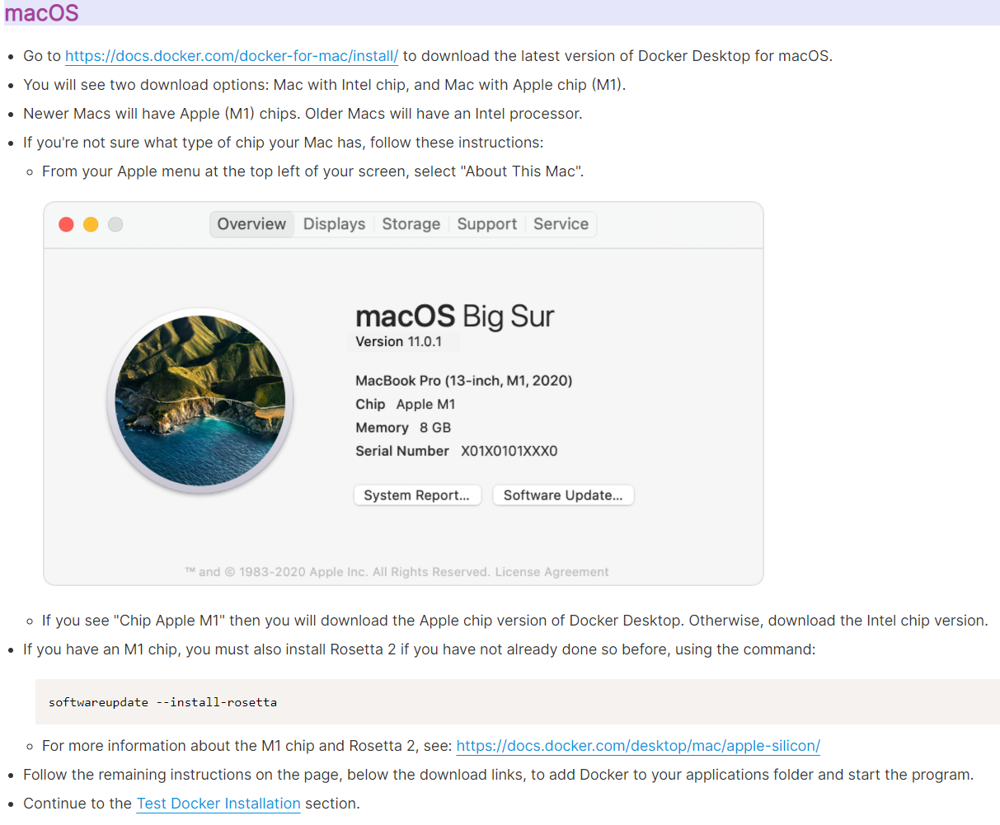
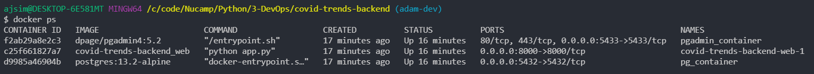

# **Public Health Trends Backend**

### **What and why**

This is the backend part of a fullstack application. Ideally this application will serve as the database and API for COIVDTrends, a Canadian application dedicated to showing Canadians geographically relevant COVID-19 data.

### **Technology**

- Python along with Django framework are used to communicate with the database and generate an API for the client to query the database.
- PostgreSQL is used as the database. With Postgres our API can make SQL queries on the data.
- Django acts as an all-in-one framework for API creation. It includes an ORM, as well as routing.
- Docker will be used to containerize both the backend application, as well as the database. This will help with development and deployment on Microsoft Azure.

## **API Endpoints Reference**

**Dev base url: localhost:8000**

### **Geographical**

| METHOD | NAME                  | PATH                                                                      | RESULT                                                                      |
| ------ | --------------------- | ------------------------------------------------------------------------- | --------------------------------------------------------------------------- |
| GET    | all health regions    | base_url/api/health-regions                                               | returns all recrods from the health_regions table                           |
| GET    | single health region  | base_url/api/health-regions/<span style="color:lightgreen">{hr_uid}<span> | returns single record based on id parameter                                 |
| Get    | health regions by fsa | base_url/api/fsa/<span style="color:lightgreen">{fsa}<span>               | return an array of one or more health regions belonging to the provided fsa |

## **Steps to Replicate Dev Environment**

1. Clone this repo
2. Download Docker Desktop for [Windows](https://hub.docker.com/editions/community/docker-ce-desktop-windows/) or [Mac](https://docs.docker.com/docker-for-mac/install/)

- **Windows Install**

  

  [Download WSL2 msi here](https://wslstorestorage.blob.core.windows.net/wslblob/wsl_update_x64.msi)

- **Mac Install**

  

3. On the root directory (where the docker-compose.yml file resides), type "docker compose up -d" into the terminal. This will take a while the first time, since Docker is downloading all required images from DockerHub. Our docker-compose.yml will start multiple containers and place them on the same network. Once completed, you can input "docker ps" into the terminal to see the running containers:

- 

4. Ensure you have a .env file (you should ask a colleague for their .env file, as the values are not to be shared on github) on the root directory, which includes the appropriate values for the following keys:

   ```
   # dev environment
   DEBUG=True

   # database settings
   DB_NAME=???
   DB_USER=???
   DB_PASSWORD=???
   DB_HOST=???
   DB_PORT=???

   SECRET_KEY=???

   ```

5. All Django apps are dependent on a set of default tables to store users, groups, session information, migrations logs, etc. These default tables are part of the built-in Django framework and are required for a Django website to function properly. To generate these tables, make sure that your Docker Compose containers are all running, then open a bash terminal and run the following two commands:

   ```
   docker compose exec web python manage.py makemigrations --noinput
   docker compose exec web python manage.py migrate --noinput
   ```

6. There are two options to seed the database:

   1. predefined, manually created records via [fixtures](https://docs.djangoproject.com/en/4.0/howto/initial-data/) located in ./app/geo_api/fixtures. To do so, use the following command:

   ```
    docker compose exec web python manage.py loaddata geo_fixture
   ```

   2. randomly generated records that will respect the typecasting on the model definitions, as well as table relationships, via a small python package called [django-seed](https://github.com/Brobin/django-seed).

   ```
   docker compose exec web python manage.py seed geo_api --number=15
   ```

7. The API, postgres database, and pgAdmin (Postgres GUI) should now be running each in their own containers. Visit pgAdmin by visiting [localhost:5433/browser/](http://localhost:5433/browser/)

8. Due to Docker bind mounting specified in the docker-compose.yml, there is no need to remake Docker images or restart the server during development. Changes to API endpoints and routing within ./app should be reflected automatically.

## **Testing**

### **API Endpoint Testing**

[Join our workspace on Postman](https://app.getpostman.com/join-team?invite_code=e88b15df4602e4abdd93cb66ef04e5e4&target_code=50e347fcc74bdefaeefb6d6a3605fa31)

If the link above doesn't work, have Adam invite you via email.

### **Unit Testing**

From ./app, testing can be done with the pytest unit testing package via the following command:

```
pytest -v
```

## **Q&A**

1. **Did you choose to use an ORM or raw SQL? Why?**
   Flask was initially chosen as a microserver framework. I also wished to avoid ORMs with Flask. Quickly, after doing some research, it became apparent that avoid ORMs was not going to be possible, and that I would have to embrace them. In order to get better documentation and community support, I decided to change to Django. It's more opinionated than Flask, which means documentation is less fragmented.

2. **What future improvements are in store, if any?**
   n/a

<!-- Example of a valid get request:

```
{
  "email":"a@g.com",
  "password":"@my_secret_password_123",
  "phone_number":"9991234563",
  "birthday":"1999-06-06"
}
```

### **Endpoint Grouping Two**

| METHOD | NAME                    | PATH                                                          | RESULT                                           |
| ------ | ----------------------- | ------------------------------------------------------------- | ------------------------------------------------ |
| GET    | get all companions      | base_url/companions                                           | returns all recrods from the companion table     |
| GET    | get single companion    | base_url/companions/<span style="color:lightgreen">{id}<span> | returns single record based on id parameter      |
| POST   | create single companion | base_url/companions                                           | creates a new record based on valid JSON request |
| DELETE | delete single companion | base_url/companions/<span style="color:lightgreen">{id}<span> | deletes a record based on id parameter           |

Example of a valid post request:

```
{
	"name":"Sabrina",
        "sex":"female",
	"user_id": 4,
	"sexual_orientation_id": 1,
	"city_id": 1
}
```

### **Endpoint Grouping Three**

| METHOD | NAME                 | PATH                                                      | RESULT                                           |
| ------ | -------------------- | --------------------------------------------------------- | ------------------------------------------------ |
| GET    | get all patrons      | base_url/patron                                           | returns all recrods from the patron table        |
| GET    | get single patron    | base_url/patron/<span style="color:lightgreen">{id}<span> | returns single record based on id parameter      |
| POST   | create single patron | base_url/patron                                           | creates a new record based on valid JSON request |
| DELETE | delete single patron | base_url/patron/<span style="color:lightgreen">{id}<span> | deletes a record based on id parameter           |

-->

## **Postman API Endpoint Export**

tbd

## **Entity Relationship Diagrams**

database documentation (including ERDs), queries for development, and database initialize SQL can be found here: ./data/schema

# **Limitations & Shortcomings**

# **Successes**

\*(Dev) denotes work done for the benefit of the development environment

- ✅ (Dev) Docker Compose yml creates 3 containers on a single network: api (backend code), pg (postgres), and pgadmin
- ✅ (Dev) Docker Compose yml generates the postgres database from raw SQL durion container build
- ✅ (Dev) Docker Compose yml has volumes setup correctly to enable hot reloading of server files (i.e., no rebuilding of images required)
- ✅ (Dev) The API ports for the development host machine and the container are correctly mapped to 8000, so the API returns JSON objects
- ✅ (Dev) First ORM models produced and first database migrations made
- ✅ (Dev) First true GET request made to database for health regions
- ✅ (Dev) Added django-seed package for auto-populating models with random data
- ✅ (Dev) Implemented fixturesy for auto-populating models with predefined data

# **Troubleshooting**

- migration: if you have problems with migration, use "docker compose down" to destroy all running containers, then delete the migrations within ./app/api/migrations, but leave **init**.py

- database is not initializing. messages include "database not shutdown properly", and "PostgreSQL database already exists, skipping initialization. Ensure you're running your docker compose commands from the root directory. Try the following:

```
docker compose down
docker volume ls | awk '$1 == "local" { print $2 }' | xargs --no-run-if-empty docker volume rm
docker compose up -d
```

- unkown issues: before troubleshooting a mysterious issue, it might be usefull to fully destroy all elements of this app on Docker and re-initialize the containers. While the containers are running, enter the following into terminal:

```
docker compose down --rmi all --volumes
```
